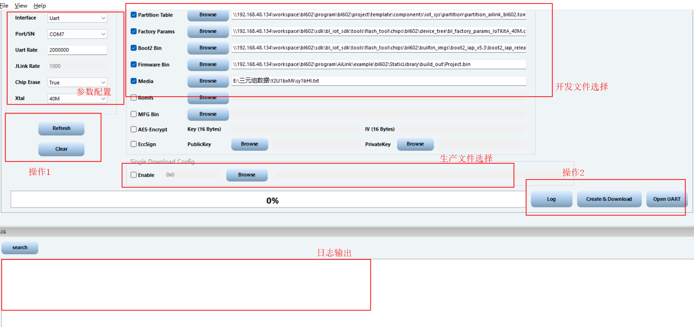
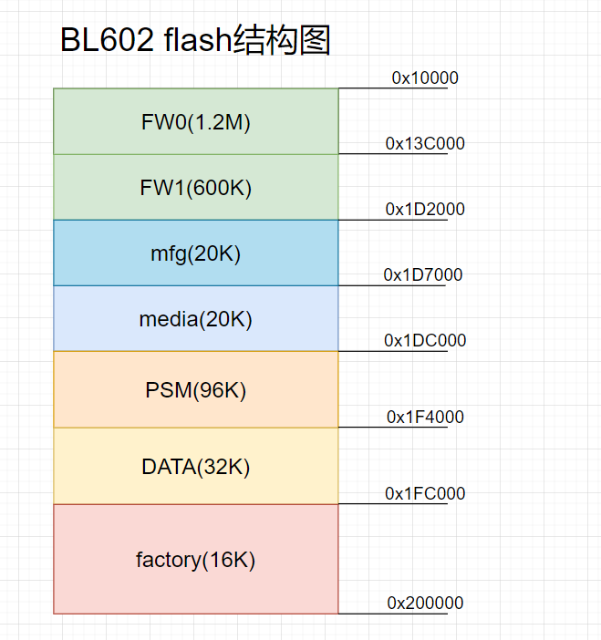
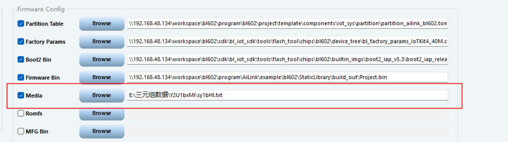

# BL602固件烧录教程


## 1. 烧录工具介绍

### 1）烧录工具存放路径

```
AiLink/libraries/bl_iot_sdk/tools/flash_tool
```

* 在flash_tool目录下有两个可执行文件，一个是运行Linux环境，另外一个是运行在window环境
  * Linux：BLDevCube
  * window：BLDevCube.exe

### 2）烧录工具界面介绍



* 参数配置
  * **Interface**：用于选择下载烧录的通信接口，可以选择 Jlink 或者 UART, 用户根据实际物理连接进行选择
  * **COM Port**：当选择 UART 进行下载的时候这里选择与芯片连接的 COM 口号，可以点击 Refresh 按钮进行
    COM 号的刷新
  * **Uart Speed**：当选择 UART 进行下载的时候，填写波特率，推荐下载频率 2M
  * **Chip Erase**：默认设置为 False，下载时按照烧录地址和内容大小进行擦除，选择 True 时，在程序烧录之前会
    将 Flash 全部擦除
  * **Xtal**：用于选择板子所使用的晶振类型
  
* 开发文件选择
  * **Partition Table**：使用 Dev Cube 目录下对应芯片型号 partition 文件夹中的分区表, 分区文件主要是根据 Flash
    大小确定，默认选择 2M 的分区表配置文件
    
    * **注意**：
      
      **在AiLink上的bl602示例demo，其使用的分区表并非在Dev Cube目录下，而是在示例demo里，其路径如下：**
      
      ```
      AiLink/example/bl602/OpenSource/Project/components/iot_sys/partition/partition_ailink_bl602.toml
      ```
    
  * **Boot2 Bin**: 它是系统启动后运行的第一个 Flash 程序，负责建立 BLSP 安全环境，并引导主程序运行，使用
    Dev Cube 目录下对应芯片型号 builtin_imgs 文件夹中的 Boot2 Bin 文件
    
  * **Firmware Bin**：用户编译生成的 bin 文件，这里选择生成的 helloworld.bin
  
  * **Media/Romfs**：Media 和 Romfs 二选一，如果勾选 Media，选择的是文件，如果勾选 Romfs，则选择的是文
    件夹
    
    * **注意**：
      
      在AiLink上的bl602示例demo上，在Media区域是存储demo所需三元组数据，其文件格式为txt文件。
    
  * **MFG Bin**：选择 MFG 文件，MFG 文件是 RF 产测时候使用的应用程序，根据晶振类型，选择 Dev Cube 目录
    下对应芯片型号 builtin_imgs/mfg 文件夹中的 mfg bin 文件
    
  * **AES-Encrypt**：如果使用加密功能，需要将 AES-Encrypt 选项选中，并在旁边的文本框中输入加密所使用的 Key
    和 IV。输入的是十六进制对应的“0”~“F”，一个 Byte 由两个字符构成，所以 Key 和 IV 分别要求输入 32 个
    字符。需要注意的是 IV 的最后 8 个字符（即 4Bytes）必须全为 0
    
  * **EccSign**：如果使用签名功能，需要将 EccSign 选项选中，并在旁边的 PublicKey 选择公钥文件，PrivateKey
    选择私钥文件，工具会生成 pk hash 并写入 efuse 中，烧写完成后启动时会自动做签名
  
* 生产文件选择
  * **Single Download Config**：勾选 Enable 后可下载单个 Raw 文件到指定的 Flash 地址，在左侧文本框填写下载
    的起始地址，以 0x 打头
  
* 操作1

  * **Refresh**：刷新COM号口
  * **Clear**：清除日志输出

* 操作2

  * **Create & Download**：下载
  * **Open UART**：打开串口

* 日志输出：输出日志信息


## 2. Flash分区表介绍

* 在AILink上的bl602示例demo里，需用以下路径的分区表。

  ```
  AiLink/example/bl602/OpenSource/Project/components/iot_sys/partition/partition_ailink_bl602.toml
  ```

  该分区表主要规划了三元组数据存储、配网信息数据存储和固件运行区域大小。

* Flash分区表规划图如下：




## 3. 三元组数据存储介绍

### 1）通过Dev Cube烧录在flash

* 三元组数据主要是写入在txt文件上，然后通过Dev Cube烧录工具将数据烧录在Media区域上。如下图：

  

* 写在txt文件的数据格式

  ```c
  {
  	"username":"4JoFcj",
  	"password":"lXbWymgZogn9Kv",
  	"deviceid":"hWs2RP3WazdEIk"
  }
  ```

  该数据格式是以 json格式的字符串存储，其json数据里的字段名不可修改，而其字段对应的内容可根据不同的三元组数据而修改。

  

### 2）通过AT指令写入flash

​			后续添加补充


